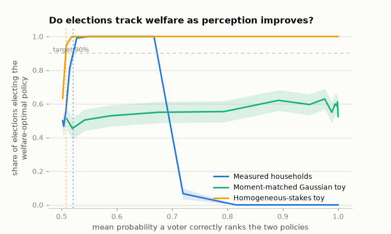

# Democrasim

Do elections select the welfare-maximizing policy when voters misperceive
how policies would affect them?

Democrasim simulates that question with the inputs measured and the
behavioral layers labeled:

- **The electorate is measured.** Every voter is a voting-age adult from
  PolicyEngine's certified, population-calibrated Populace microdata —
  120,408 records representing 268M adults.
- **The platforms are actual encoded reforms.** Two federal tax changes
  with opposite incidence, budget-matched within 3% and labeled
  generically: *Policy A* raises the Child Tax Credit base amount to
  $3,200; *Policy B* caps the top marginal income tax rate at 34%. Their
  totals — $39.1B and $38.0B a year of household net-income change — are
  model quantities including state-tax interactions, not budget scores.
- **The true impacts are engine-computed.** Each voter carries their
  household's change in annual net income under each policy, including
  knock-on effects through other taxes and benefits.
- **Perception is the headline assumption.** How accurately voters see
  their own stakes sits behind a small `PerceptionModel` interface, so a
  survey-estimated misperception distribution can drop in later without
  touching anything else ([#3](https://github.com/MaxGhenis/democrasim/issues/3)).
  The other layers are assumptions too, and are stress-tested as such:
  how each policy's cost is financed, the welfare metric, the electorate
  size, and who turns out are explicit, swappable model choices — the
  findings note reports how the results move under each.

> **What this is and isn't.** A thought experiment about one mechanism:
> self-interested voting under misperception of measured household
> impacts. It is not political science — real voters weigh values,
> identity, and information far beyond their own net income. It is never
> election prediction. Platforms are generic policies, not candidates or
> parties. Every number this package produces is a simulation result
> under stated assumptions, not observed data.

## What the measured inputs changed

The original Democrasim (preserved in git history) asked the same
questions on invented numbers: abstract policy "values," normal
distributions, placeholder welfare. Rebuilding on measured impacts moved
every headline result — details, figures, and stress tests in
[docs/findings.md](docs/findings.md), which was revised against four
independent referee reports (archived with the adjudication in
[docs/reviews/](docs/reviews/)):

| | Toy worlds | Measured households |
|---|---|---|
| Stakes | everyone has one, similar size | 76% of adults ≈ $0 gross; a fifth have $1,000s |
| Accuracy needed to track welfare | sharp threshold just above a coin flip (jury theorem) | ≈0.52 mean ranking accuracy at 10,001 voters — an n-specific number that falls toward 0.5 as the electorate grows (closed form at any size via `analytic_plurality_curve`) |
| More accuracy always helps? | yes (monotone) | **no** — at perfect accuracy the outcome is decided by the *sign* of the two policies' $4/year residual cost gap, a welfare-irrelevant quantity, so tracking is welfare-independent there; moderate noise silences that margin and restores perfect tracking. The ceiling (accuracy ≈0.69) survives at every electorate size |
| Moment-matched Gaussian world | — | no tracking band at 10,001 voters (smooth, near-centered margins) — though its sub-point vote margin resolves to near-certainty at national scale; what's shape-robust is the *absence* of the measured world's certainty band |
| Systematic bias | one more parameter | ≈$221/voter/year of shared bias flips an election that independent noise 5× larger cannot |



## Quick start

```bash
uv sync --group dev          # core install (the measured artifact ships in the wheel)
uv run democrasim demo       # tour: policies, welfare, elections at three noise levels
uv run democrasim sweep      # reproduce the headline experiments into docs/
```

```python
import numpy as np
import democrasim as d

electorate = d.apply_financing(d.load_measured_electorate(), "per_capita")
spec = d.ElectionSpec(
    perception=d.LinearGaussianPerception(noise_sd=1_000.0),  # the assumption
    rule=d.Plurality(),
    welfare=d.Isoelastic(eta=1.0),
)
result = d.run_election(electorate, spec, np.random.default_rng(0))
print(electorate.policy_labels[result.winner], result.tracked)
```

## The pieces

```
democrasim/
  electorate.py   # real households as arrays: impacts, weights, adults per household
  perception.py   # PerceptionModel: perceived = attenuation·true + bias + noise
  voting.py       # Plurality (indifference abstains) / Approval / InstantRunoff
  welfare.py      # Utilitarian, Isoelastic(η); explicit financing closes the budget
  election.py     # sample voters -> perceive -> vote -> grade against welfare
  experiments.py  # accuracy sweeps, threshold finder, bias sweeps
  toy.py          # labeled synthetic comparators (the old model's worlds)
  data.py         # the committed artifact + its provenance metadata
  engine/         # rebuilds the artifact from PolicyEngine (one sim per subprocess)
```

Two aggregation conventions run through everything: voting is per adult
(each adult perceives and votes on their household's full impact), and
welfare counts each household's dollars once (contributions divide by
`hh_adults`). Engine deltas are gross, so `apply_financing` makes each
policy budget-neutral under an explicit rule (`per_capita`,
`proportional`) before the headline experiments; the financing rule is an
assumption and is stress-tested in the findings.

## The headline assumption: perception

`LinearGaussianPerception(noise_sd, bias, attenuation)` says a voter's
belief about their own stake is `attenuation · truth + bias + N(0, σ²)` —
exactly the regression a perception survey would estimate, and those
*parameters* are where survey comparability lives. Sweeps also report a
derived accuracy coordinate (the mean probability a voter correctly ranks
the two policies for their own household), useful for intuition but not a
sufficient statistic: it depends on the financing rule's margins, and
shared bias can raise it while tracking collapses — the findings plot
every curve against the σ primitive as well. `GroupedPerception` varies
the model by demographic cell; any object with a
`perceive(electorate, rng)` method — including one fitted to survey
data — slots in unchanged.

## The measured artifact

`democrasim/data/us_2026_measured.parquet` (1.2MB, committed) is model
output with provenance, not observed data: one row per voting-age adult,
with the household's engine-computed impact under each policy, survey
weight, baseline net income, household composition, and state. The
sidecar `.meta.json` records the engine versions, the certified dataset
(Populace `populace_us_2024`, pinned revision and SHA-256), both reform
parameter dictionaries with explicit start and end dates, totals, and the
validation results from the build. Rebuild it with:

```bash
uv sync --extra engine --group dev
uv run democrasim build-data        # ~20 min: 3 simulations, one per subprocess
```

## Development

```bash
uv run pytest            # 146 behavioral tests; artifact tests run off the committed data
uv run ruff check .
uv run ruff format .
uv run python scripts/robustness.py      # every stress row behind the findings
uv run python scripts/descriptives.py    # every descriptive number behind the findings
uv run python scripts/make_notebook.py   # re-execute docs/demo.ipynb
```

`tests/test_findings_regression.py` pins the artifact facts the findings
rest on — most fragilely, the sign of the residual cost gap between the
two policies — so an engine rebuild that moves the findings' world fails
loudly instead of silently inverting the conclusions.

## Endogenous platforms

`democrasim.strategic` closes the loop: two candidates — households from
the data, each mixing a selfish component (their own net delta) with a
societal one (a welfare metric with their own inequality aversion) —
pick positions in a shared 2D policy space spanned by the measured
incidence vectors, and pure Nash equilibria are computed exactly.
Perfect information disciplines platforms to the status quo through
undercutting; noise relaxes the discipline and self-serving programs
scale with it; competition filters platforms by constituency breadth,
not welfare. Details, validation of the interpolated policy space, and
every number: [docs/strategic.md](docs/strategic.md).

## Roadmap

- [#3](https://github.com/MaxGhenis/democrasim/issues/3) — replace the
  parametric perception assumption with a survey-measured misperception
  distribution.

## License

[Unlicense](LICENSE) — public domain.
