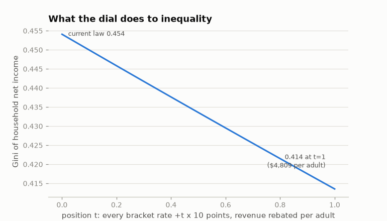
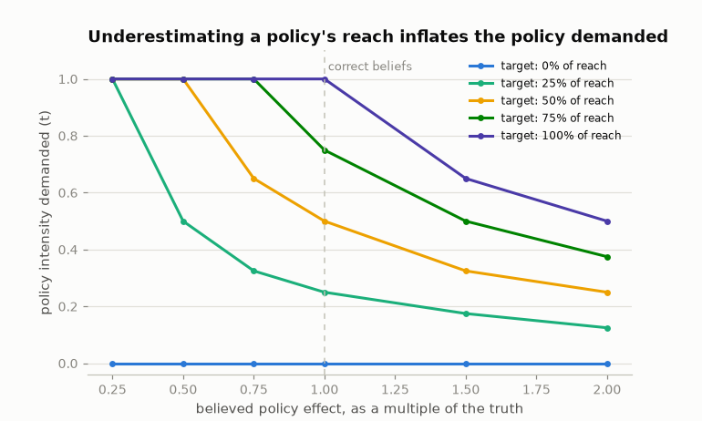

# A continuous axis: ideal outcomes and beliefs about policy

The rest of this project asks whether elections rank *policies* correctly.
This layer asks a different question, on a different object. The policy is
a continuous dial; voters care about the *outcome* it produces, not the
dial; and what they know is a belief about how far the dial moves the
outcome. Demand for policy is then derived, not primitive — and it is
wrong in a specific, measurable direction when the belief is wrong.

Every number regenerates with `uv run python scripts/axis_experiments.py`
([results/axis_summary.json](results/axis_summary.json)).

## The dial

Position `t` in [0, 1] raises every federal income tax bracket rate by
`t × 10` points and returns the revenue as an equal per-adult transfer —
the linear-tax-plus-demogrant axis of the redistribution literature,
priced on measured household incidence through the real tax code. At
`t = 1` the engine scores $1,286.6B of revenue, a **$4,809 transfer per
adult per year**, and **68.6% of households gaining**
([results/axis_map.csv](results/axis_map.csv)).

Gross incidence is interpolated linearly in `t` from one engine-computed
endpoint. Two more engine runs price that approximation at the midpoint:
0.31% of totals, 97.4% of households within $1, mean absolute error
$16.27 ([results/axis_linearity_validation.json](results/axis_linearity_validation.json)).

The outcome the axis moves:



| | Gini | ΔEDE per household | Transfer per adult |
|---|---|---|---|
| Current law (`t = 0`) | 0.4541 | — | — |
| `t = 0.5` | 0.4336 | +$4,211 | $2,404 |
| `t = 1` | 0.4135 | +$7,661 | $4,809 |

Mean net stake runs from +$7,777 in the bottom decile to −$35,671 in the
top; the gain-to-loss crossing sits in the eighth decile (up to
$175,758), not at a single break-even income, because household size
changes how many transfers arrive at the same income.

## Preferences over outcomes, beliefs about the mapping

An actor holds an ideal Gini `g*`, a price `k` on missing it, and a
selfish weight on their own household's dollars — all in dollars, the
scale the rest of the package uses:

```
U(t) = s · own(t) − (1 − s) · k · 100 · | Ĝ(t) − g* |
```

Beliefs enter as a *slope* on the mapping, not as noise on each option:

```
Ĝ(t) = G(0) + λ · ( G(t) − G(0) )
```

`λ = 1` is correct, `λ < 1` understates the policy's reach, `λ = 0`
believes it does nothing. Own-stake beliefs work the same way — perceived
own stake is `t · (own + ε)` with one draw per voter — so a voter's
perceived utility curve stays coherent across the continuum instead of
jumping between neighboring positions. One consequence is worth stating:
because both the mean and the spread of a selfish voter's comparison
scale with the distance between two positions, their *direction*
preference is scale-free — a purely selfish voter is exactly as decisive
between `t = 0.5` and `t = 0.525` as between `0` and `1`.

## Wrong beliefs inflate demand, reciprocally

A voter needs the true Gini to reach `G(0) + (g* − G(0)) / λ` before their
belief reports the target. Since the measured Gini curve is nearly linear
in `t` (steps of −0.00104 at the bottom, −0.00099 at the top), demand
scales as `1/λ` until the axis runs out
([results/axis_demand.csv](results/axis_demand.csv)):

| Ideal Gini | λ = 0.25 | λ = 0.5 | λ = 0.75 | λ = 1 | λ = 1.5 | λ = 2 |
|---|---|---|---|---|---|---|
| 0.4440 (a quarter of the axis's reach) | 1.000 | 0.500 | 0.325 | **0.250** | 0.175 | 0.125 |
| 0.4338 (half) | 1.000 | 1.000 | 0.650 | **0.500** | 0.325 | 0.250 |
| 0.4237 (three quarters) | 1.000 | 1.000 | 1.000 | **0.750** | 0.500 | 0.375 |
| 0.4135 (the axis's floor) | 1.000 | 1.000 | 1.000 | **1.000** | 0.650 | 0.500 |



Halve what a voter thinks the policy does and they ask for twice as much
of it. Someone who wants half the achievable equality gain and believes
the policy is half as effective as it is demands the *entire* axis — the
same platform an actual maximalist demands, for a completely different
reason. Read backwards, this says the observable ("what policy do you
support?") separates values from beliefs only if you measure both.

## Elections aggregate beliefs by median, not by mean

Give one electorate a shared goal and split it between correct voters
(λ = 1) and attenuated ones (λ = 0.25), then sweep the attenuated share
`q` ([results/axis_belief_mixtures.csv](results/axis_belief_mixtures.csv)).
Two office-seeking candidates play the position game; every cell has a
unique pure equilibrium.

| Attenuated share `q` | 0.0–0.4 | 0.5 | 0.6–1.0 |
|---|---|---|---|
| Mean belief in the electorate | 1.00–0.70 | 0.625 | 0.55–0.25 |
| Enacted position | **0.500** | 0.750 | **1.000** |

At `q = 0.4` the average voter believes the policy is 30% weaker than it
is, and the election still enacts exactly what a fully correct electorate
would. At `q = 0.6` it enacts the maximum. Misperception does not average
out here and it does not scale smoothly: on a single-peaked axis the
median belief rules, and everything else is irrelevant. That is the
opposite of the fixed-platform result, where independent perception noise
cancels across voters and *improves* welfare tracking
([findings.md](findings.md)) — same model, same data, opposite
aggregation, because the ballot is a continuum rather than a pair.

Where competition lands is otherwise unremarkable and exactly Downsian:
across all 30 (target, belief) cells, the equilibrium enacted position
equals the electorate's median ideal position to the grid
([results/axis_equilibria.csv](results/axis_equilibria.csv)).

## Self-interest wants the maximum

A purely self-interested electorate on measured incidence enacts `t = 1`
at every own-stake noise level tested ($0, $1,000, $10,000): 68.6% of
households gain from the full program, so the median voter does. The
classic result — median income below mean income makes a majority favor
redistribution — holds on the measured distribution, and the model adds
that own-stake misperception does not disturb it, because noise on the
gradient does not move the sign for most voters.

So on this axis moderation does not come from self-interest. It comes
from values (an ideal short of maximum equality) or from beliefs (an
overestimate of what policy achieves). Both are unmeasured.

## Scope

**No behavioral response.** The engine holds labor supply, avoidance, and
growth fixed, so more redistribution always raises
equally-distributed-equivalent income and the inequality-averse
planner's optimum is the corner `t = 1`. Every interior result here comes
from voters' ideal points, not from an efficiency cost — this axis is a
model of demand formation, not a welfare-optimal-tax exercise, and the
usual interior optimum would require an elasticity nobody has measured
here. **One outcome statistic.** Gini summarizes the distribution; a
different statistic would move ideal points and could change orderings.
**Labeled distributions.** Targets, belief slopes, `k`, and the type
mixture are assumptions with nothing measured behind them — they are the
survey targets ([#3](https://github.com/MaxGhenis/democrasim/issues/3)),
and the belief slope in particular is a single elicitable number: "if
rates rose ten points and the money came back as an equal check, what
would happen to the gap between rich and poor?" **Two candidates, one
shot, pure strategies** on a 41-point grid, as in
[strategic.md](strategic.md).

## Reproduction

```bash
uv run python scripts/axis_experiments.py           # every table and both figures
uv run python scripts/build_redistribution_axis.py  # 3 engine runs (~20 min)
uv run pytest tests/test_axis.py                    # 24 behavioral tests
```
