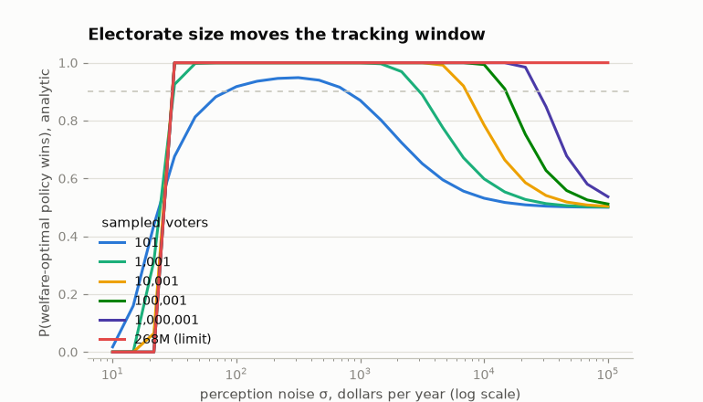

# Findings: what measured stakes changed

The toy-era Democrasim asked three questions on invented numbers: how does
voter accuracy affect whether elections pick the welfare-better platform,
is there an accuracy threshold, and how much does systematic bias distort
outcomes. This note re-asks them on measured inputs — households from
population-calibrated microdata, actual encoded reforms, engine-computed
impacts — and records where the answers moved. Every number is a
simulation result produced by a committed generator (`democrasim sweep`,
`scripts/robustness.py`, `scripts/descriptives.py`; provenance blocks
record the artifact hash); none is a measurement of any real electorate.

**Setup.** Policy A raises the CTC base amount to $3,200 ($39.1B of gross
household net-income change in 2026, including state-tax interactions —
these are model totals, not budget scores); Policy B caps the top marginal
rate at 34% ($38.0B). Both are financed by an equal per-adult levy
(headline; alternatives stress-tested in §3), so each is budget-neutral
and the welfare ranking is purely distributional. An isoelastic (log)
welfare metric ranks Policy A above Policy B. Voters know only their own
household's net-of-financing impact, perceived through
`attenuation·truth + bias + N(0, σ²)` with independent errors across
voters and policies; plurality voting, with exact perceived indifference
abstaining.

Two framing definitions apply throughout. **"Tracked"** means the election
elected the *ballot-best* policy — the one the welfare metric ranks higher
*of the two on the ballot*. Under this metric both financed policies score
below the status quo (log-welfare changes ≈ −2.3×10⁵ vs −5.1×10⁵), and the
status quo is not a plurality option; §7 returns to what that does to the
approval-voting comparison. **Headline Monte Carlo results are specific to
elections of 10,001 sampled voters** (240 elections per grid point, Wilson
95% intervals); §4 gives the closed-form picture at every electorate size,
because the thresholds scale with size and no single n's curve is "the"
answer.

## 1. Real stakes are nothing like invented stakes


Gross of financing, 79% of adults see ≈$0 from Policy A and 97% from
Policy B. Policy A's gains arrive in per-child quanta — visible spikes at
$1,000, $2,000, $3,000, $4,000 — concentrated on the 20.3% of households
with eligible children; 9.9% of its dollars reach the top decile
(household-weighted deciles of baseline household net income, here and
throughout). Policy B's gains go almost entirely to the top decile (99.7%
of dollars; 3.1% of households gain).


What voting actually runs on is the *margin*: how much better one policy
is than the other for your household. Net of per-capita financing, the
measured margin distribution is a staircase: the two levies differ by
$4.10 per adult per year ($146.16 vs $142.05), so the roughly
three-quarters of adults untouched by either reform hold margins of a few
dollars — 47% of adults within $10, 75.5% within $25 — while 19.9% of
adults (all in households with children) hold pro-A margins above $500
and 2.6% hold pro-B margins below −$500. The mean absolute margin is
$652, but almost nobody holds a stake near that mean. The old model's
homogeneous world gives every voter the mean; the Gaussian world smears
it smoothly. Neither has the two-cliff structure that drives everything
below.

## 2. Accuracy → welfare tracking is not monotone on measured stakes


Sweeping perception noise σ from 0 to $100,000 and plotting the share of
elections electing the ballot-best policy against mean ranking accuracy
(the probability a voter correctly ranks the two policies for their own
household), at 10,001 voters:

| World | Tracking ≥90% first reached | At perfect accuracy |
|---|---|---|
| Homogeneous-stakes toy | accuracy ≈ 0.507 | 100% tracked |
| Moment-matched Gaussian toy | never at this n (stays ≈0.50–0.58) | 54% |
| Measured households | accuracy ≈ 0.522 | **0% — Policy B wins every election** [Wilson 95%: ≤1.6%] |

The **homogeneous toy** is the Condorcet jury theorem: identical stakes
plus independent errors mean any per-voter accuracy above 0.5 aggregates
to near-certainty across 10,001 voters. (It is a canonical benchmark, not
a replica of the archived model, whose voters drew heterogeneous weights,
accuracies, biases, and turnout.)

The **Gaussian toy** — matched to the measured means and covariances of
(impact A, impact B, log income) — never tracks reliably *at this
electorate size*: its margin distribution is smooth and nearly centered,
leaving a perfect-information vote margin of a fraction of a percentage
point, which 10,001 sampled voters cannot resolve. §4 shows the same toy
tracking near-certainly at national scale — so "the Gaussian world never
tracks" is a statement about n as much as about shape. What *is*
shape-robust: its tracking curve is flat and noisy where the measured
curve has a wide band of certainty, because smooth margins have no
high-stakes bloc for noise to liberate.

The **measured world** does neither. Tracking is essentially perfect
across a wide band of moderate noise (σ from about $50 to $2,000 — every
estimate 1.000 with Wilson lower bounds of 0.984; still 0.996 at
σ=$4,600) and collapses at *both* ends:

- **Too much noise** (σ ≫ $5,000): even the $1,000-per-child stakes
  drown, and the election decays toward a coin flip, as in any world.
- **Too much accuracy** (σ ≲ $25): the ~76% of adults whose entire stake
  is their household's share of the $4.10 levy difference stop being
  noise and become a signed bloc. At perfect accuracy 78.7% of adults
  strictly prefer Policy B, 21.3% prefer Policy A, and plurality elects
  Policy B every time. Between the extremes, moderate misperception turns
  the trivial-stakes majority into fair coins that cancel, and the
  informed high-stakes minority decides. **In this regime, misperception
  helps.**

## 3. Perfect accuracy makes the outcome welfare-independent — a knife-edge, dissected

The collapse at high accuracy is not "informed voters choose badly." At
perfect information the outcome is decided entirely by the *sign* of the
residual cost gap between the two policies — $1.1B on $39B, i.e. the 2.9%
budget-matching tolerance chosen at calibration — a quantity with no
connection to the welfare ranking. Perfect accuracy does not make
elections anti-track welfare; it makes them **welfare-independent**,
handing the decision to whichever side of an arbitrary residual the
no-stakes bloc lands on. Stress tests at perfect accuracy:

| Variant | Tracked | Turnout | What changed |
|---|---|---|---|
| Headline (per-capita financing) | 0% | 100% | 78.7% vote their $4/yr levy saving |
| Proportional-to-income financing | 0% | 99.8% | same sign for nearly every no-stakes household |
| **Sign-flip counterfactual** (B rescaled to cost 3% *more* than A) | **100%** | 100% | the same bloc now votes *for* the ballot-best policy — same mechanism, opposite verdict |
| Exact-parity counterfactual (B rescaled to cost precisely A's total) | 100% | 24% | levy gap is $0; the mass is exactly indifferent and abstains |
| Gross deltas (no financing; also the deficit-blind-perception case) | 100% | 24% | the untouched 76% abstain |
| Per-capita financing + abstain below $10 | 0% | 53% | multi-adult households' levy margins survive |
| Per-capita financing + abstain below $25 | 100% | 24% | the whole levy staircase abstains |

Two counterfactual rows are synthetic rescalings, labeled as such in
their generators. The pattern: whenever the trivial-stakes mass is silent
— its margin exactly zero, or a modest indifference band (behavioral, not
derived from pivotal-voting calculus: at any realistic scale pivot
probabilities cannot rationalize a $25 cutoff) — elections track from low
accuracy all the way to perfect, entering the 90% band around accuracy
0.59 in the gross and parity rows. Whenever that mass votes its signed
sliver, it outvotes every concentrated stake in the electorate, in
whichever direction the sliver points, because elections count people,
not dollars. Which side of this knife-edge a real electorate sits on is
an empirical question about behavior at trivial stakes — a
perception-and-participation question the planned survey
([#3](https://github.com/MaxGhenis/democrasim/issues/3)) bears on
directly. It is also build-contingent: the artifact's cost-gap sign is
pinned by `tests/test_findings_regression.py`, so an engine rebuild that
flips it fails loudly instead of silently inverting this section.

One further honest note: under this welfare metric both financed policies
score *below* the status quo — log welfare puts more weight on the
per-capita levy paid by low-income childless adults than on CTC gains
that, because the refundability phase-in caps what the lowest-income
families receive, land mostly in the middle of the distribution. That is
a measured-incidence fact the invented numbers could never surface.

## 4. Everything above is n-indexed — here is the whole ladder



For plurality with linear-Gaussian perception, the tracking probability
has a closed form at any electorate size
(`democrasim.analytic_plurality_curve`), so the Monte Carlo results can
be placed on the full ladder. The accuracy band where tracking ≥90%
holds, on the measured electorate:

| Sampled voters | 90% band (mean ranking accuracy) |
|---|---|
| 101 | 0.598 – 0.641 |
| 1,001 | 0.550 – 0.689 |
| 10,001 (headline) | 0.520 – 0.689 |
| 100,001 | 0.511 – 0.689 |
| 1,000,001 | 0.508 – 0.689 |
| large-population limit | 0.502 – 0.689 |

The *entry* threshold is jury-theorem √n logic and collapses toward 0.5
as the electorate grows — so "elections track from accuracy ≈0.52" is a
statement about 10,001 voters, not about elections. The *exit* ceiling
(≈0.69) is an expected-vote-share crossing and is n-invariant: the
knife-edge of §3 survives at every scale, including the limit, where the
curve becomes a step function — certain failure below σ≈$25, certain
tracking above it. The Gaussian toy's fate reverses along the same
ladder: its sub-percentage-point perfect-information margin is a coin
flip at 10,001 voters and near-certainty at national scale.

## 5. The threshold question, answered on real stakes

The old model asked "how accurate do voters need to be?" On measured
stakes the answer splits:

- **Entry: barely above a coin flip, with the caveat that "barely" is
  n-dependent** (§4). At any size, stake heterogeneity does the work the
  jury theorem's homogeneity did: a small, correctly-signed minority with
  large stakes beats a large canceling mass.
- **The ceiling matters as much as the floor.** Tracking survives only
  while mean accuracy stays below ≈0.69 — at every electorate size.

Two cautions about the accuracy axis itself. It is a property of the
perception model *and* the electorate's margins — the same σ scores 0.64
on the financed electorate and 0.99 on the gross one, whose zero-margin
adults leave the denominator — and it is not a sufficient statistic for
outcomes: in the committed bias sweep, mean accuracy *rises* from 0.61 to
0.65 while tracking collapses from 100% to 0%, because bias toward the
majority's true preference "improves" measured accuracy. Survey
comparability properly attaches to the perception *parameters*
(attenuation, bias, σ), which are exactly what a perception survey would
estimate; σ is the primitive and the same curves are provided against it
([accuracy_curve_sigma](figures/accuracy_curve_sigma.png)).

## 6. Bias is the cheap way to flip an election


Noise cancels; bias doesn't. Holding noise at σ = $1,000 (where unbiased
elections track essentially 100% of the time), a systematic misperception
that Policy B is worth more than it truly is flips the median election at
**≈$221 per voter per year** (auto-refined grid: 1.7% of elections flip
at $178, 51.7% at $222, 97.5% at $267). That is a third of the mean
absolute stake and a fifth of one per-child CTC increment. Elections in
this model are extraordinarily robust to large independent misperception
and extraordinarily fragile to small shared misperception — which is what
framing, salience, and advertising plausibly move.

## 7. Voting rules are not interchangeable here


With two policies and no exact ties, instant-runoff is arithmetically
identical to plurality and inherits the knife-edge (the equivalence is
implementation-scoped: exact indifference force-votes for the first
policy by default, and on the gross electorate — where indifference is
the modal ballot — that would manufacture a landslide;
`InstantRunoff(indifferent_abstain=True)` provides the abstaining
variant).

**Approval voting behaves differently at perfect accuracy**: with
approval defined against the status quo, the no-stakes majority — for
whom both financed policies are small net losses — approves neither,
silencing itself exactly like the abstention rows of §3, and the
ballot-best policy wins every time on 23% turnout. Two readings, stated
plainly. Under the two-option benchmark used everywhere else, approval
repairs the knife-edge. Under the three-option ranking the welfare metric
itself induces — where the status quo is ranked *first* — a 23%-approval
winner is still a welfare-reducing enactment, and no rule that must elect
one of the two policies can track that benchmark. Approval's real
property here is the self-silencing channel, not welfare optimality; the
model does not represent a collective "neither" option.

## Related work: what is known, what is quantified here

None of the mechanisms above is new to theory; this note's contribution
is putting engine-computed dollar magnitudes on them with certified
microdata, in a reusable harness. The moderate-noise regime in which
idiosyncratic error makes plurality weight stakes rather than heads — and
its reversion to head-counting as noise vanishes — is the probabilistic-
voting aggregation logic of Coughlin–Nitzan (1981) and Lindbeck–Weibull
(1987). The homogeneous benchmark is Condorcet's jury theorem, and the
fragility to shared errors echoes Ladha (1992) on correlated votes — the
"$221 of correlated bias beats $1,000 of independent noise" result is
that literature in dollars, and the broader noise-vs-bias contrast is the
"miracle of aggregation" debate (Page–Shapiro 1992; Caplan 2007). A
trivial-stakes majority outvoting an intense minority is Dahl's (1956)
intensity problem. Abstention by the effectively-indifferent repairing
outcomes is kin to rational-ignorance and turnout logic from Downs (1957)
and to the information-based abstention of Feddersen–Pesendorfer's (1996)
swing voter's curse — though the $25 band used here is behavioral, not
derived. Measured misperception of one's own tax incidence, the object
[#3](https://github.com/MaxGhenis/democrasim/issues/3) would estimate,
has an empirical literature (Bartels 2005; Stantcheva 2021).

## What would move these results

- **Perception is assumed, not measured.** Everything above uses the
  linear-Gaussian family with errors independent across voters — including
  adults in the same household — and across policies. A survey-fitted
  distribution (attenuation, bias, noise, demographic variation,
  household-shared error) drops into the same interface
  ([#3](https://github.com/MaxGhenis/democrasim/issues/3)).
- **Self-interest only.** Voters care only about their own household's
  annual net income — no sociotropic preferences, values, or partisanship.
  The model measures what *this* mechanism does, not what voters do.
- **Financing.** Per-capita and proportional rules both hand the no-stakes
  bloc a signed sliver whose direction is the 2.9% calibration residual
  (§3's sign-flip row); financing choices that zero it, or deficit
  financing that hides it, restore monotone tracking.
- **Welfare metric.** Isoelastic η=1 with a $1,000 income floor. The
  ranking is stable across η ∈ {0.5, 1, 2} and under per-capita and
  square-root equivalence scales, but **flips to Policy B at η ≥ 3**,
  where the floor's censoring of the poorest households' levy dominates —
  recorded in `descriptives.json` (`isoelastic_optimal_by_eta`). η=0 is
  floor-censored dollars, degenerate under exact budget neutrality
  (`run_election` flags this as `degenerate_welfare`).
- **Static, annual, two policies.** No behavioral responses, no
  multi-year dynamics, no candidate repositioning (the Nash layer is
  [#2](https://github.com/MaxGhenis/democrasim/issues/2)).

## Reproduction

```bash
uv run democrasim sweep                  # headline CSVs, figures, headline.json
uv run python scripts/robustness.py     # every stress row and the n-ladder
uv run python scripts/descriptives.py   # every descriptive number in §1–§3
uv run python scripts/make_notebook.py  # re-execute docs/demo.ipynb
```

Each generator writes a provenance block (artifact SHA-256, package
version, seeds, grids) beside its results in [results/](results/), and
`tests/test_findings_regression.py` pins the artifact facts this note
rests on. The measured artifact's own provenance (engine versions,
certified dataset revision and SHA-256, reform dictionaries, build
validations) is in
[`democrasim/data/us_2026_measured.meta.json`](../democrasim/data/us_2026_measured.meta.json).
This note was revised in response to four independent referee reports
(two Claude, two Codex reviewers), archived with the author-side
adjudication in [reviews/](reviews/).
