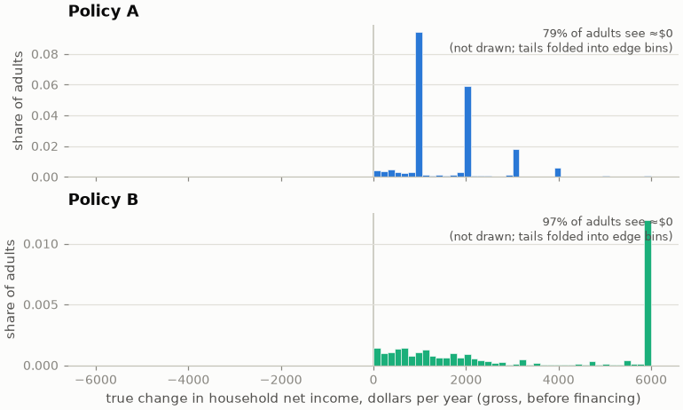
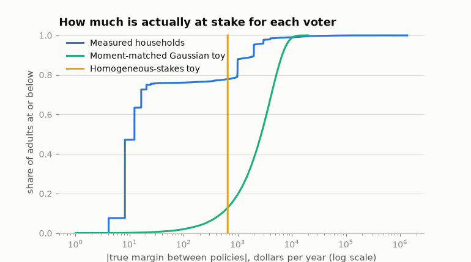
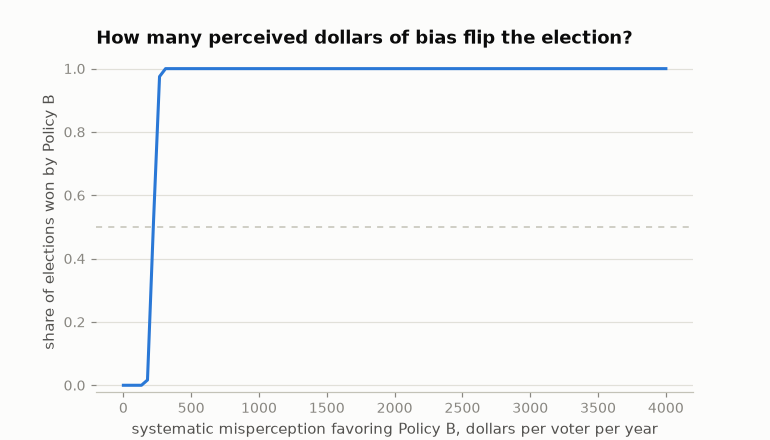
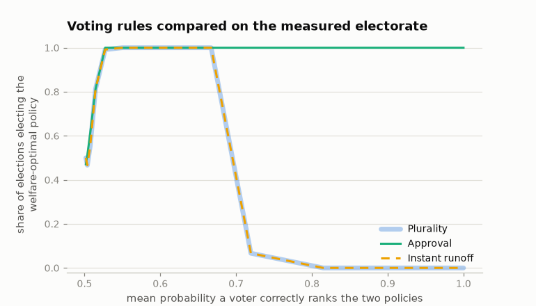

# Findings: what measured stakes changed

The toy-era Democrasim asked three questions on invented numbers: how does
voter accuracy affect whether elections pick the welfare-better platform,
is there an accuracy threshold, and how much does systematic bias distort
outcomes. This note re-asks them on measured inputs — real households,
actual encoded reforms, engine-computed impacts — and records where the
answers moved. Every number is a simulation result from the configuration
in [results/headline.json](results/headline.json) (240 elections per grid
point, 10,001 sampled voters per election, seed 42) or the robustness runs
listed at the end; none is a measurement of any real electorate.

**Setup.** Policy A raises the CTC base amount to $3,200 ($39.1B in 2026);
Policy B caps the top marginal rate at 34% ($38.0B). Both are financed by
an equal per-adult levy (headline; alternatives stress-tested below), so
each is budget-neutral and the welfare ranking is purely distributional.
An isoelastic (log) welfare metric ranks Policy A above Policy B. Voters
know only their own household's net-of-financing impact, perceived through
`attenuation·truth + bias + N(0, σ²)`; plurality voting, with exact
perceived indifference abstaining. "Tracked" means the election elected
the policy the welfare metric ranks first *among the two on the ballot* —
under this metric both financed policies score slightly below the status
quo, which is not a ballot option under plurality (the approval result
below is the exception).

## 1. Real stakes are nothing like invented stakes



Gross of financing, 79% of adults see ≈$0 from Policy A and 97% from
Policy B. Policy A's gains arrive in per-child quanta — visible spikes at
$1,000, $2,000, $3,000, $4,000 — concentrated on the 20.3% of households
with eligible children (9.9% of its dollars reach the top decile). Policy
B's gains go almost entirely to the top decile (99.7% of dollars; 3.1% of
households gain).



What voting actually runs on is the *margin*: how much better one policy
is than the other for your household. Net of per-capita financing, the
measured margin distribution is a staircase: the two levies differ by
$4.11 per adult per year ($146.16 vs $142.05), so the roughly
three-quarters of adults untouched by either reform hold margins of a few
dollars — 47% of adults within $10, 75.5% within $25 — while 19.9% of
adults (all in households with children) hold pro-A margins above $500
and 2.6% hold pro-B margins below −$500. The mean absolute margin is
$652, but almost nobody holds a stake near that mean. The old model's
homogeneous world gives every voter the mean; the Gaussian world smears
it smoothly. Neither has the two-cliff structure that turns out to drive
everything.

## 2. Accuracy → welfare tracking is not monotone on measured stakes


Sweeping perception noise σ from 0 to $100,000 and plotting the share of
elections electing the welfare-preferred policy against mean ranking
accuracy (the probability a voter correctly ranks the two policies for
their own household):

| World | Tracking ≥90% first reached | At perfect accuracy |
|---|---|---|
| Homogeneous-stakes toy | accuracy ≈ 0.507 | 100% tracked |
| Moment-matched Gaussian toy | never (stays ≈0.45–0.63) | 52% |
| Measured households | accuracy ≈ 0.521 | **0% — Policy B wins every election** |

The **homogeneous toy** is the Condorcet jury theorem: identical stakes
plus independent errors mean any per-voter accuracy above 0.5 aggregates
to near-certainty across 10,001 voters. This is the world the old model
lived in, and it is why "more accuracy always helps" felt like a law.

The **Gaussian toy** — matched to the measured means and covariances of
(impact A, impact B, log income), so incidence and the welfare ranking
survive — never tracks. With a smooth, roughly symmetric margin
distribution centered near zero, the electorate is split ~50/50 at every
accuracy level, and the election stays a coin flip no matter how well
voters perceive. First and second moments are not what makes elections
informative; the *structure* of who holds which stake is.

The **measured world** does neither. Tracking is essentially perfect
across a wide band of moderate noise (σ between about $50 and $2,000 —
mean ranking accuracy 0.55 to 0.67) and collapses at *both* ends:

- **Too much noise** (σ ≫ $2,000): even the $1,000-per-child stakes drown,
  and the election decays toward a coin flip, as in any world.
- **Too much accuracy** (σ ≲ $20): the 76% of adults whose entire stake is
  their household's share of the $4.11 levy difference stop being noise
  and become a signed bloc. At perfect accuracy 78.7% of adults strictly
  prefer Policy B (their few dollars of levy saving), 21.3% prefer Policy
  A, and plurality elects Policy B 100% of the time — the opposite of the
  welfare ranking. Between those extremes, moderate misperception turns
  the trivial-stakes majority into fair coins that cancel, and the
  informed high-stakes minority decides. **In this regime, misperception
  helps.**

## 3. The perfect-information failure is a knife-edge — and instructive

The collapse at high accuracy is not a robust law; it is what a forced
binary choice does to an electorate where a large majority holds a tiny
but *signed* common margin. Stress tests at perfect accuracy:

| Variant | Tracked | Turnout | What changed |
|---|---|---|---|
| Headline (per-capita financing) | 0% | 100% | 78.7% vote their $4/yr levy saving |
| Proportional-to-income financing | 0% | 100% | same sign for every no-stakes household |
| Gross deltas (no financing) | 100% | 24% | the untouched 76% are *exactly* indifferent and abstain |
| Exact-parity counterfactual (B rescaled to cost precisely A's total) | 100% | 24% | levy gap is $0; the mass abstains |
| Per-capita financing + abstain below $10 | 0% | 53% | multi-adult households' levy margins survive |
| Per-capita financing + abstain below $25 | 100% | 24% | the whole levy staircase abstains |

The pattern: whenever the trivial-stakes mass is silent — because its
margin is exactly zero, or because voters rationally abstain over
sub-$25 annual stakes — elections track welfare from coin-flip accuracy
all the way to perfect accuracy, and the old monotone intuition returns.
Whenever that mass votes its sign, it outvotes every concentrated stake
in the electorate, because elections count people, not dollars. Which
side of the knife-edge a real electorate sits on is an empirical question
about behavior at trivial stakes — a perception-and-participation
question the planned survey
([#3](https://github.com/MaxGhenis/democrasim/issues/3)) bears on
directly.

Two further honest notes. First, the financing rule that creates the
$4.11 margin is itself the modeling choice that closes the budget;
deficit-financed perception (voters seeing gross impacts only) behaves
like the gross row above. Second, under this welfare metric both financed
policies score slightly *below* the status quo — log welfare puts more
weight on the per-capita levy paid by low-income childless adults than on
CTC gains that, because the refundability phase-in caps what the
lowest-income families receive, land mostly in the middle of the
distribution. That is a measured-incidence fact the invented numbers
could never surface.

## 4. The threshold question, answered on real stakes

The old model asked "how accurate do voters need to be?" On measured
stakes the answer splits:

- **Entry threshold: barely above a coin flip.** Tracking first exceeds
  90% at mean ranking accuracy ≈0.521 (homogeneous toy: 0.507). Stake
  heterogeneity does the work the jury theorem's independence assumption
  did: a small, correctly-signed minority with large stakes beats a large
  canceling mass.
- **But the ceiling matters as much as the floor.** On the headline
  configuration, tracking survives only while accuracy stays *below*
  ≈0.67. "More informed voters" is not unambiguously stabilizing once
  everyone's micro-stakes become visible to them.

## 5. Bias is the cheap way to flip an election



Noise cancels; bias doesn't. Holding noise at σ = $1,000 (a level at
which unbiased elections track welfare essentially 100% of the time), a
systematic misperception that Policy B is worth just **≈$219 per voter
per year** more than it truly is flips the median election; by $300 the
flip is total. That is a third of the mean absolute stake and a fifth of
one per-child CTC increment. The jury theorem dies with correlated
errors: elections in this model are extraordinarily robust to large
independent misperception and extraordinarily fragile to small shared
misperception — which is what advertising, framing, and salience
plausibly move.

## 6. Voting rules are not interchangeable here



With two policies, instant-runoff is arithmetically identical to
plurality and inherits the knife-edge. **Approval voting does not**: with
approval defined against the status quo (approve any policy you perceive
as a net gain), the no-stakes majority — for whom both financed policies
are small net losses — approves neither, filtering itself out exactly
like rational abstention. At perfect accuracy approval elects the
welfare-preferred policy 100% of the time on 23% turnout. The old model
treated the voting rule as a detail; on measured stakes, whether the rule
offers an implicit "neither" changes the perfect-information outcome from
0% tracked to 100%.

## What would move these results

- **Perception is assumed, not measured.** Everything above uses the
  linear-Gaussian family. A survey-fitted distribution (attenuation,
  bias, noise, demographic variation) drops into the same interface
  ([#3](https://github.com/MaxGhenis/democrasim/issues/3)).
- **Self-interest only.** Voters here care only about their own
  household's annual net income — no sociotropic preferences, values, or
  partisanship. The model measures what *this* mechanism does, not what
  voters do.
- **Static, annual, two policies.** No behavioral responses, no
  multi-year dynamics, no candidate repositioning (the Nash layer is
  [#2](https://github.com/MaxGhenis/democrasim/issues/2)).
- **Welfare metric and floor.** Isoelastic η=1 with a $1,000 income floor;
  η=0 (utilitarian) is degenerate under exact budget neutrality, and
  higher η strengthens Policy A's ranking. The knife-edge results do not
  depend on the metric (they are about vote counts), but "which policy
  should win" does.
- **Financing.** Per-capita and proportional rules both create the tiny
  signed margins; other closures (progressive financing, deficit) change
  the no-stakes mass's sign or existence.

## Reproduction

```bash
uv run democrasim sweep              # headline CSVs, figures, headline.json
uv run python scripts/robustness.py # financing/welfare variants, parity counterfactual
uv run python scripts/make_notebook.py
```

All CSVs behind the tables are in [results/](results/). The measured
artifact's provenance (engine versions, certified dataset revision and
SHA-256, reform dictionaries) is in
[`democrasim/data/us_2026_measured.meta.json`](../democrasim/data/us_2026_measured.meta.json).
