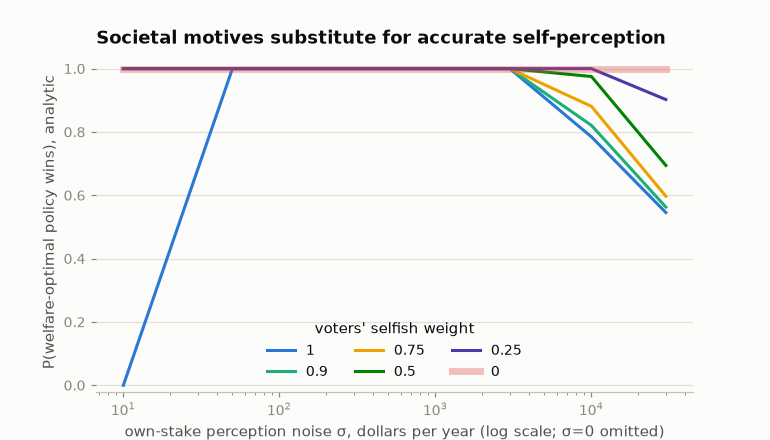
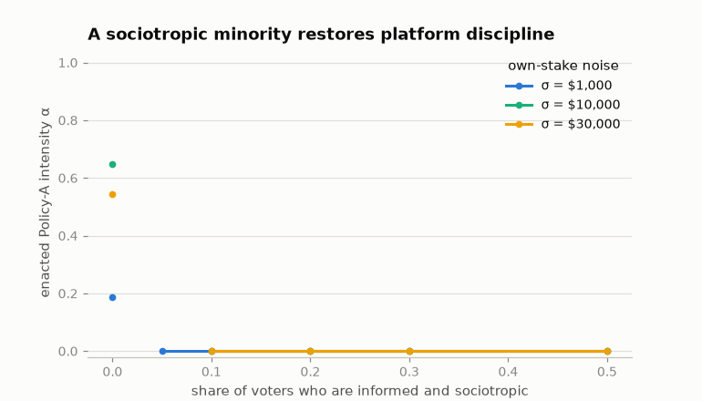

# Heterogeneous preferences: every actor gets a welfare function

The baseline model votes pure perceived self-interest. This layer gives
voters the same utility family the candidates carry
([strategic.md](strategic.md)): each voter mixes their own household's
perceived net delta with a perceived *societal* value —

```
utility = s · (own household Δ$) + (1 − s) · (societal Δ$)
```

— where ``s`` is the voter's selfish weight and the societal value is
the policy's change in equally-distributed-equivalent (EDE) household
income under the voter's own inequality aversion η. The EDE is the
equal income yielding the same welfare as the actual distribution, so
it ranks policies exactly as the welfare metric does while being
denominated in dollars — commensurable with own stakes, no
normalization. A population is a mixture of ``VoterType``s: shares,
selfish weights, inequality aversions, and information quality (own
noise, societal noise, societal bias) can all differ by type.
``MixedMotivePerception`` satisfies the same ``PerceptionModel``
protocol as everything else, so every voting rule, sweep, and the
strategic layer's equilibrium tables take mixtures unchanged. Every
number below is exact — analytic mixtures on the fixed platforms, exact
pure-Nash enumeration on the endogenous ones — and regenerates with
`uv run python scripts/heterogeneous_experiments.py`
([results/heterogeneous_summary.json](results/heterogeneous_summary.json)).

## A sliver of societal motive cures the knife-edge

Under perfect self-perception the fixed-platform election is decided by
the trivial-stakes majority voting its −$4.10/year levy-gap margin —
the knife-edge where tracking is welfare-independent. The societal
signal is fifty times larger: E_A − E_B = −$169.29 − (−$379.06) =
+$209.77 of EDE per household. So a homogeneous electorate needs only
3.8% of its utility weight on society before that mass flips: at σ = 0,
tracking jumps from 0 to 1 as the selfish weight falls through
**s\* = 0.9623**
([results/heterogeneous_tracking.csv](results/heterogeneous_tracking.csv)).
Voters who care almost entirely about themselves, but not quite, vote
as if they could see the welfare ranking — because on budget-financed
policies their own stakes are mostly noise-sized while the societal
stake is not.

## Societal motives substitute for accurate self-perception

At high own-stake noise the baseline electorate decays toward a coin
flip; societal weight buys the tracking back
(P(welfare-optimal policy wins), 10,001 voters):

| Voters' selfish weight | σ = $10,000 | σ = $30,000 |
|---|---|---|
| 1.0 (baseline) | 0.785 | 0.546 |
| 0.75 | 0.881 | 0.597 |
| 0.5 | 0.975 | 0.694 |
| 0.25 | 1.000 | 0.902 |
| 0 (sociotropic) | 1.000 | 1.000 |



The two informational channels are not symmetric: own-stake noise
averages out only through the plurality aggregate, while the societal
signal — here perceived exactly (σ_soc = 0) — is common to every voter
who weights it.

## Values disagreement is its own distortion channel

Sociotropic voting fixes misperception distortions and introduces a new
one: voters can perceive everything correctly and still disagree,
because they hold different welfare functions. On the measured
electorate the two financed policies' EDE values cross between η = 2
and η = 2.5 — at η = 1 Policy A dominates (−$169.29 vs −$379.06 per
household), at η = 2.5 Policy B does, by all of $2.88 (−$699.62 vs
−$696.74). Split an all-informed, all-sociotropic electorate between
those two lenses and the outcome follows the majority lens; grade it
and every majority composition is simultaneously "tracked" under one
welfare function and "failed" under the other, while the 50/50 split is
a coin flip under both
([results/heterogeneous_summary.json](results/heterogeneous_summary.json)).
Perception surveys cannot close this gap; it is value pluralism, not
information.

## A sociotropic minority disciplines candidates

The strategic layer's noise result — self-serving platforms escalate as
σ grows ([strategic.md](strategic.md)) — assumed every voter is a noisy
self-interested one. Mix in a share *q* of informed sociotropic voters
(s = 0, η = 1, exact societal perception) against the same two purely
selfish candidates
([results/heterogeneous_discipline.csv](results/heterogeneous_discipline.csv)):

| q | σ = $1,000 | σ = $10,000 | σ = $30,000 |
|---|---|---|---|
| 0 | 0.19 | 0.65 | 0.55 |
| 0.02 | *cycling* | *cycling* | *cycling* |
| 0.05 | 0.00 | *cycling* | *cycling* |
| 0.10+ | 0.00 | 0.00 | 0.00 |

(enacted Policy-A intensity; "0.00" is zero to numerical precision)



Three features:

1. **Ten percent is enough.** At q = 0.10 every noise level has pure
   equilibria again and all of them enact the status quo — the welfare
   optimum this space offers. The bloc votes deterministically against
   whichever candidate proposes the more welfare-negative program, and
   a tenth of the electorate outweighs the selfish margin any program
   can buy among its beneficiaries.
2. **The transition cycles.** At q = 0.02–0.05 (high σ) the pure-Nash
   set is *empty*: proposing a program wins the noisy selfish margin
   until the opponent undercuts and takes the sociotropic bloc, which
   restores the incentive to propose — best responses chase each other,
   with proposals reaching up to the full program inside the cycle. The gaps
   in the figure are that regime, reported as dynamics rather than
   equilibria.
3. **The bloc degrades gracefully.** Sociotropic voters who misread the
   societal value with $500/household of noise (against a signal that
   peaks near $380) still cut enacted intensity at 30% share from 0.65
   to 0.11. And an electorate that is uniformly *half* selfish — no
   informed bloc at all — cuts it from 0.63 to 0.44 on the same
   13-point grid
   ([results/heterogeneous_summary.json](results/heterogeneous_summary.json)):
   diffuse partial altruism disciplines much less than a small informed
   bloc, because it shrinks every voter's selfish margin instead of
   creating votes that deterministically punish.

## Scope

Types mix independently of stakes and demographics (a correlated
assignment is a mechanical extension of the same tables); the societal
signal a voter perceives is the ΔEDE of the electorate actually voting;
σ_soc, societal bias, and the η distribution are labeled assumptions
with nothing measured behind them — this layer exists so that survey
estimates of *sociotropic* perception can drop in beside the own-stake
ones ([#3](https://github.com/MaxGhenis/democrasim/issues/3)). Mixed
strategies in the cycling regime are not computed; the note reports
best-response dynamics there instead. The EDE uses the same $1,000
income floor as the welfare metrics.

## Reproduction

```bash
uv run python scripts/heterogeneous_experiments.py   # all tables + both figures
uv run pytest tests/test_preferences.py              # EDE + mixed-motive behavior
uv run pytest tests/test_strategic.py                # voter-type equilibrium tables
```
