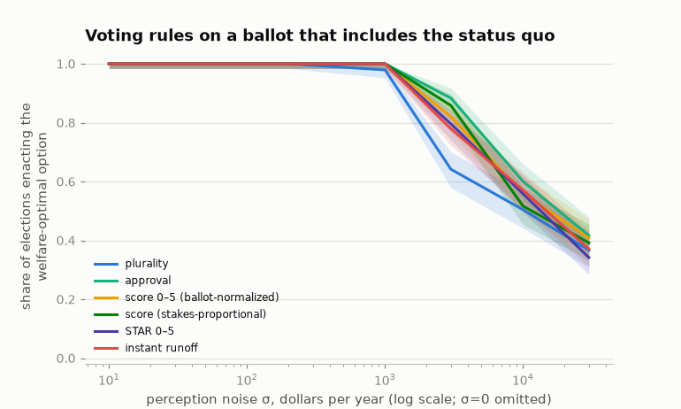

# Voting rules on a ballot that includes the status quo

The fixed-platform experiments offer voters two policies, and the welfare
optimum — the status quo — is not on the ballot. That ballot also
degenerates the rules comparison: with two options, a sincere
ballot-normalized score ballot *is* a plurality ballot. This experiment
puts the status quo on the ballot as a third option and runs every
implemented rule across the noise grid: plurality, approval (both
threshold conventions), 0–5 score (two normalizations), STAR, and
instant runoff. Grading is unchanged — Isoelastic(η=1), under which the
status quo beats both financed programs — and mistakes are priced in
dollars of equally-distributed-equivalent income per household. A rule
that elects nobody leaves current law in place (graded as the status
quo). 240 elections of 10,001 voters per cell; every number regenerates
with `uv run python scripts/rules_experiments.py`
([results/rules_comparison.csv](results/rules_comparison.csv)).

## Results

P(enacts the welfare-optimal option):

| Rule | σ = $0 | σ = $1,000 | σ = $3,000 | σ = $10,000 | σ = $30,000 |
|---|---|---|---|---|---|
| Plurality | 1.000 | 0.979 | 0.642 | 0.504 | 0.367 |
| Approval (strict >) | **0.000** | 1.000 | 0.883 | 0.600 | 0.417 |
| Approval (inclusive ≥) | 1.000 | 1.000 | 0.858 | 0.588 | 0.383 |
| Score 0–5, ballot-normalized | 1.000 | 1.000 | 0.821 | 0.558 | 0.408 |
| Score, stakes-proportional | 1.000 | 1.000 | 0.858 | 0.517 | 0.392 |
| STAR 0–5 | 1.000 | 1.000 | 0.796 | 0.558 | 0.342 |
| Instant runoff | 1.000 | 1.000 | 0.779 | 0.571 | 0.371 |



Three findings:

1. **The two-option knife-edge was a ballot artifact, not a plurality
   pathology.** With the status quo on the ballot, plurality tracks
   perfectly at σ = 0: the 76% trivial-stakes mass strictly prefers
   current law to either levy and simply votes for it. The
   fixed-platform failure ([findings.md](findings.md)) came from forcing
   that mass to choose between two options it disliked — agenda design,
   not ballot aggregation, was the binding constraint. Every rule tested
   tracks perfectly at σ = 0 on the three-option ballot, with one
   exception:
2. **Approval's threshold convention is worth the entire result.** Under
   the strict convention — approve options perceived *better than* the
   status quo — the status quo on the ballot can never be approved, so
   at σ = 0 the credit program's beneficiaries elect it unopposed:
   tracking 0%, regret $169.29 per household, the worst cell in the
   table. Make the threshold weakly inclusive and tracking is 100%.
   Real approval ballots resolve this with instructions ("approve any
   candidate you find acceptable"), and in an electorate where
   three-quarters of voters are near-indifferent, that instruction — not
   the aggregation rule — decides the perfect-information outcome. Away
   from σ = 0, noise breaks the exact ties and the two conventions
   converge.
3. **Under noise, the ordering reverses and approval leads.** From
   σ = $3,000 up, strict approval is the most noise-robust rule (0.883
   tracked, $19.75 mean regret at $3,000 — three times better than
   plurality's $60.66), because its threshold filters ballots whose
   perceived values are all noise below zero. The cardinal rules sit
   between (score variants ≈ STAR ≈ instant runoff), and plurality
   degrades worst. Stakes-proportional scoring — score magnitude carrying
   dollar intensity, the referendum-like aggregation — performs about
   like ballot-normalized scoring here (better at $3,000, worse at
   $10,000): with the electorate's stake distribution, intensity
   weighting buys no reliable advantage over full-scale sincere ballots.

No rule dominates: plurality is exact at perfect information and worst
under noise; strict approval is worst at perfect information and best
under noise. On this electorate the choice of rule is worth up to $169
of EDE per household at σ = 0 (the approval convention) and about $41 at
σ = $3,000 (approval vs plurality) — both smaller than the $209.77
separating the two programs, and both dwarfed by what the agenda (which
options reach the ballot) decides.

## Scope

Ballots are sincere: score voters spend the full scale or report clipped
dollars, approval voters apply a fixed threshold, nobody strategizes.
Strategic exaggeration would push the cardinal rules toward approval
(their bracketing case). One ballot composition (the two measured
programs plus the status quo); rule performance under other agendas is
untested, and the agenda-formation question belongs to the position game
([strategic.md](strategic.md)). Turnout differs mechanically by rule
(approval's threshold and the indifference-abstains conventions), so
turnout-sensitive welfare claims should read the
[CSV](results/rules_comparison.csv)'s turnout column rather than compare
across rules casually.

## Reproduction

```bash
uv run python scripts/rules_experiments.py   # table, JSON summary, figure
uv run pytest tests/test_voting.py           # rule behavior, incl. Score/STAR
```
