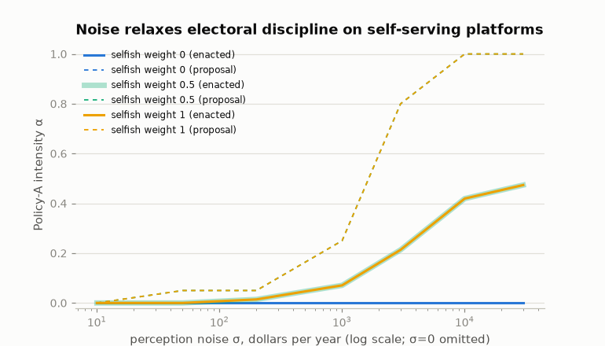

# Endogenous platforms: the position game on measured stakes

The fixed-platform findings ([findings.md](findings.md)) grade elections
against two given policies. This layer makes the platforms choices: two
candidates pick positions to maximize their own expected objectives,
knowing what the opponent picks, and the same perception-mediated
electorate decides who wins. Every equilibrium below is exact — pure
Nash by exhaustive enumeration — and every number regenerates with
`uv run python scripts/strategic_experiments.py`.

## The game

**Policy space.** A position is a pair of intensities ``(α, β)`` on the
two measured incidence vectors: α scales the CTC increment (α=1 is the
full $2,200→$3,200 change), β scales the top-rate cap depth (β=1 caps
both top brackets at 34%). Positions produce gross household deltas
``α·Δ_A + β·Δ_B``, financed per capita. Under per-capita financing net
stakes are exactly linear in ``(α, β)``, so the whole space runs on the
two committed delta columns — the status quo ``(0, 0)`` included. The
default grid is 21×21 over ``[0, 1]²``.

**Interpolation is measured, not assumed.** Within-family linearity is
an approximation, so two engine runs at the midpoints price it
([results/interpolation_validation.json](results/interpolation_validation.json)):
the rate axis is linear to 0.13% of totals (99.95% of households within
$1); the CTC axis carries real phase-in convexity — 5.0% of totals, 96%
of households within $1, mean absolute error $9. The grid stays inside
the validated range.

**Candidates.** Each candidate is a household from the data with an
objective over enacted positions:
``selfish_weight · own household's net delta + (1 − selfish_weight) ·
isoelastic welfare`` (components min–max normalized over the grid;
dollars and welfare units are not commensurable, so the weight is the
interpretable knob). An optional office rent adds a fixed win bonus.
Expected utility is ``P(win)·U(own position) + (1−P(win))·U(opponent's)``.
The headline candidates, selected deterministically from the data:
Candidate 1 is a two-adult household with three children at the median
income of child households ($109,693); Candidate 2 is a childless
household at the 95th income percentile ($385,413).

**Election.** P(win) depends only on the difference of positions,
through the same probit closed form as the fixed-platform model, at
10,001 sampled voters. One (2G−1)² difference table prices all G⁴
profile comparisons, so exact best-response matrices — and every pure
Nash profile — cost about a second per configuration.

## Results

| Candidates | σ = $0 | σ = $200 | σ = $1,000 | σ = $10,000 |
|---|---|---|---|---|
| Office-seekers (rent only) | converge on status quo | status quo | status quo | status quo |
| Both societal (η=1) | status quo | status quo | status quo | status quo |
| Selfish weight 0.5 or 1.0 | status quo | C1 proposes α=0.05, enacted ≈0.01 | C1 proposes α=0.25, enacted ≈0.07 | C1 proposes α=1.0, enacted ≈0.42 |

([results/strategic_equilibria.csv](results/strategic_equilibria.csv);
the welfare-optimal position under η=1 is the status quo, consistent
with the fixed-platform finding that both financed endpoint policies
score below it.)



Three regularities:

1. **Perfect information disciplines platforms to the status quo.** At
   σ ≤ $10 every equilibrium enacts ``(0, 0)``, whatever the candidates
   want. The fixed-platform knife-edge — the no-stakes mass voting its
   levy sliver — becomes an undercutting force: any program hands the
   opponent a cheaper-platform win, so competition converges on
   proposing nothing. Under this welfare metric that *is* the optimum:
   with endogenous platforms, perfect information produces the
   welfare-best outcome through competition, inverting the
   fixed-platform result where it produced welfare-independence.
2. **Noise relaxes the discipline, and self-interest fills the gap.**
   As σ grows, the child-household candidate's equilibrium proposal
   escalates from α=0.05 at σ=$200 to the full program at σ=$10,000,
   with the enacted (win-probability-weighted) intensity reaching 0.47.
   Under fixed platforms, moderate noise rescued welfare tracking; with
   endogenous platforms the same noise is what lets welfare-negative
   programs through. Whether misperception helps depends on who sets
   the agenda.
3. **Electoral competition filters by constituency breadth, not by
   welfare.** Candidate 2 never proposes rate-cap intensity at any
   noise level or selfish weight — a program whose gross winners are 3%
   of households cannot survive competition even when its proposer is
   purely selfish. The CTC program, with a fifth of adults as winners,
   can. The filter is a head-count, indifferent to the welfare metric.

## Scope

Two candidates, one shot, pure strategies on a grid, a shared 2D policy
space, and objectives mixed on a normalized scale — all labeled choices,
all cheap to vary. Mixed-strategy equilibria are not computed (at σ=0
the game has large pure-equilibrium sets rather than none, so nothing
here required them). The equilibrium multiplicity at low noise is
tie-driven: losing positions with identical payoffs proliferate
profiles; the *enacted* position is the invariant summary. Candidate
behavior beyond this objective family — dynamics, entry, primaries,
commitment problems — is out of scope, as is any claim about real
candidates.

## Reproduction

```bash
uv run python scripts/strategic_experiments.py     # equilibria, office-seeker variant, figure
uv run python scripts/validate_interpolation.py    # two engine runs (~16 min) + error report
uv run pytest tests/test_strategic.py              # 13 behavioral tests
```
